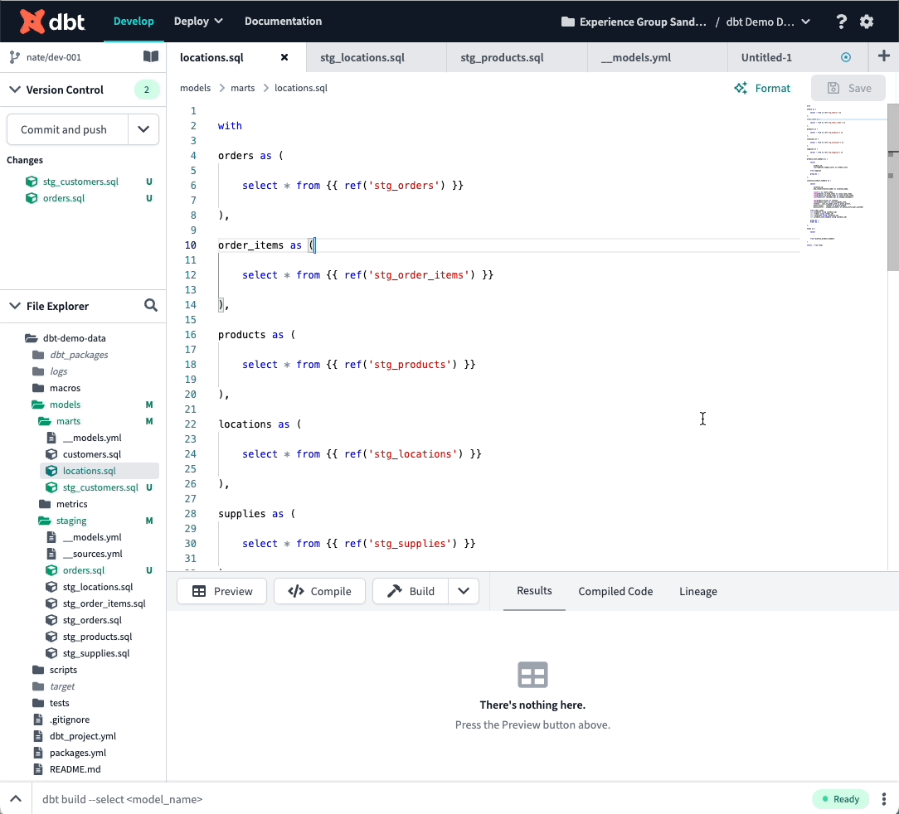

# dbt Cloud

As of October 18, 2022, the new dbt Cloud IDE includes a "Format" button that will format your code using sqlfmt. The feature is in Beta, but will be generally available on November 16.

In the initial launch, sqlfmt in dbt Cloud is not configurable, so you should use the default line length (88) when running sqlfmt locally on projects that are also edited in dbt Cloud.

You may also want to configure CI to enforce `sqlfmt --check` or to run `sqlfmt` and commit the results back to the branch, in case someone forgets to click "Format" before they hit "Save." See [here](github-actions) for more info on setting up CI using GitHub Actions.