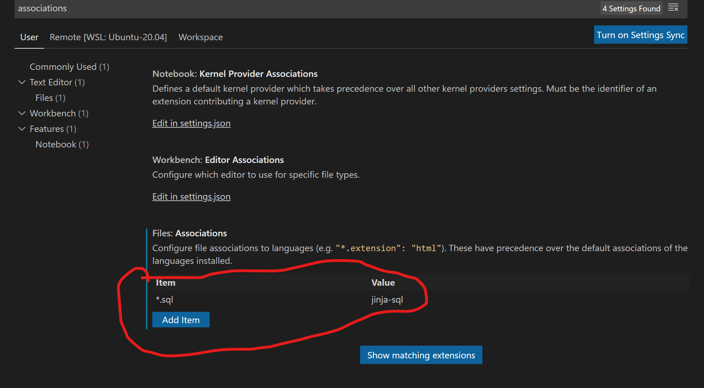

# dbt Power User (VS Code Extension)

[dbt Power User](https://github.com/innoverio/vscode-dbt-power-user) is a [VS Code Extension](https://marketplace.visualstudio.com/items?itemName=innoverio.vscode-dbt-power-user) to make VS Code work seamlessly with dbt.

The Extension has many features, including a sqlfmt-powered formatter.

After installing sqlfmt and the extension:

1. Associate your .sql files with the jinja-sql language. Select Preferences > Settings, and under Files: Associations click Add Item:
    

    Alternatively, add the following to your VS Code `settings.json`:

    ```json
    "files.associations": {
        "*.sql": "jinja-sql"
    },
    ```

1. Select "dbt Power User" (extension `id:innoverio.vscode-dbt-power-user`) as the default formatter. You can do this either by using the context menu (right click on an open dbt model in the editor) and select "Format Document With...", or you can add the following to your VS Code settings:

    ```json
    "[jinja-sql]": {
        "editor.defaultFormatter": "innoverio.vscode-dbt-power-user"
    }
    ```

2. You can enable format on save by adding another line to your VS Code settings:

    ```json
    "[jinja-sql]": {
        "editor.defaultFormatter": "innoverio.vscode-dbt-power-user",
        "editor.formatOnSave": true
    }
    ```